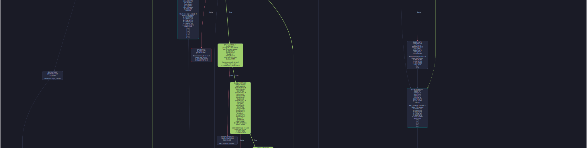

# evm-cfg-execpath
=======
# EVM CFG (Trace Highlight Fork)

A fast and accurate EVM bytecode control flow graph (CFG) generator **with dynamic trace path highlighting**.  
This fork allows you to visualize not only the static CFG, but also the actual execution path of a transaction, based on EVM trace data.

---

<p align="center">


</p>

## Installation

First, make sure rust is installed:

```bash
curl --proto '=https' --tlsv1.2 -sSf https://sh.rustup.rs | sh
```

Then:

```bash
git clone https://github.com/Avery76/evm-cfg-execpath.git
cd evm-cfg-execpath/
cargo build --release
./target/release/evm-cfg mycontract.evm --trace traces/your_trace.txt --contract 0xYourContractAddress --output mytrace.dot
```


## How It Works In Phases:

### Disassembly

Using static analysis, we can split the bytecode up into a structure representable by a graph. The following is done before executing any opcodes through a vm:

- provides contiguous blocks of instructions that are uninterruptible by jumps
- provides jumptable (jumpdests locs)
- provides all entry-nodes for blocks (jumptable | jumpi+1 locs | program counter 0)
- provides "direct" jumps (where push is directly followed by jump)
  - this info is used to create an opposing and more important "indirect" jump list
- static analysis unwinds some indirect (yet concrete) locs to direct if the push is still found within the same instruction block
- provides stack-usage information intra-block to determine how the stack is used for opcodes within the block, and how the stack exits the block

### Form Basic Edges

Jumps and Jumpis with direct push values are connected to their jumpdests. False sides of Jumpis are connected to the next instruction.

### Prune the CFG

Any nodes without incoming edges that also don't begin with a JUMPDEST are impossible to enter, and are removed. This is done to reduce clutter

### Symbolic Stack & Traversing

Essentially, the only goal left is to connect more edges when jumps are "indirect". Depending on the path the traverser used when coming into the instruction block, it may jump to separate locations. (ie: one traverser may jump to a push it carried over from block A, while another traverser may jump to a push it carried over from block B)

Finding these indirect jumps is difficult. Normally, DFS traversers can prevent revisiting previously seen nodes by using a set, but in our case, revisiting a node may be required to carry over a separate push value that jumps to a new location. When we consider allowing revisiting nodes loops immediately become a problem.

The following methods are used to prevent loops from going infinite:

- Execute only the following opcodes:
  - _AND_, PUSH, JUMP, JUMPI, JUMPDEST, RETURN, INVALID, SELFDESTRUCT, STOP
- Track only possible jump location values on the symbolic stack
  - in practice this means only tracking pushed u16 values that are also valid jumpdests (contract size is limited to 24kb, so u16 is large enough to represent all possible jumpdests)
- Prevent traversers from entering blocks that they dont have large enough stack for
- When traversing to a new block, add the (current_pc, next_pc, symbolic_stack) to a set of visited nodes
  - future traversers each check to make sure their current_pc, next_pc, and symbolic_stack are not in the set before traversing

This method is definitely not bulletproof, and there are cases where it will fail to quit out of loops. For this implementation, I only track stack values to 128 depth (max is 1024), and only up to 10 values at once. Both of these metrics are easily adjusted, but I have not ran into any cases where it was necessary to increase them.

- Fun Reversing Challenge has at most 3 tracked values on the stack at once, and they each stay within 10 depth

## About This Project

This project is a fork of [evm-cfg](https://github.com/plotchy/evm-cfg) with additional features.

### Main changes in this fork:
- Highlighting the actually executed path of a contract in the control flow graph (CFG) based on transaction trace.
- Support for filtering trace steps by contract address.
- Saving the highlighted CFG as a DOT file.

Original project: [evm-cfg](https://github.com/plotchy/evm-cfg)

---

## Features

- Static CFG generation for EVM bytecode.
- **Dynamic highlighting of the actually executed path** in the CFG, based on transaction trace.
- Filtering trace steps by contract address.
- Exporting the highlighted CFG as a DOT file for visualization.

### How Dynamic Path Highlighting Works

This fork highlights the actual execution path of a contract by:
- Parsing the transaction trace file, which contains a list of execution steps with fields such as `pc` (program counter) and `address`.
- Filtering steps to only include those matching the specified contract address.
- Mapping each `pc` value to its corresponding instruction block in the static CFG.
- Highlighting all blocks and edges that were actually executed during the transaction, based on the trace.

This allows users to visualize not just the static structure of the contract, but also the precise path taken during a specific transaction.
>>>>>>> ebdb665 (Initial commit)
